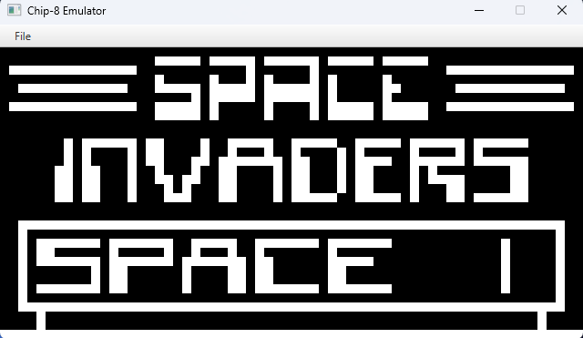
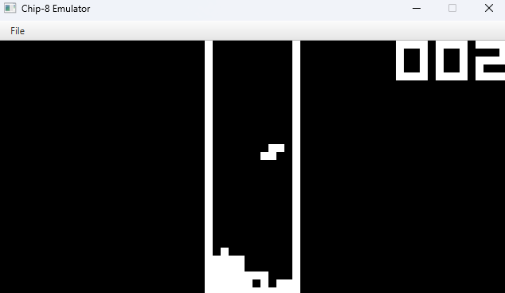
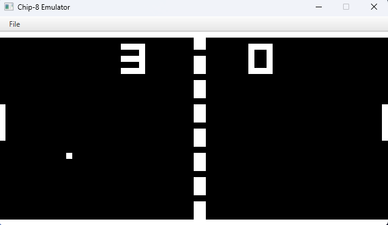
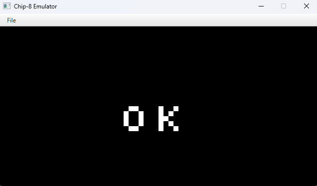

# Chip-8 Java Emulator

Chip 8 Emulator / Interpreter desenvolvido em Java com o objetivo de aprender o básico sobre emulação e como emuladores funcionam.
## Aprendizados

- Estrutura básica de um CPU.
- Básico de Operações Bitwise.
- Como carregar arquivos durante execução.
## Screenshots

## Referência

- [Emulator101](http://www.emulator101.com/welcome.html)
- [Hello, GBA! Journey of making an emulator — part 1](https://medium.com/@michelheily/hello-gba-journey-of-making-an-emulator-part-1-8793000e8606)
- [Chip-8 Test rom by Skosulor](https://www.reddit.com/r/EmuDev/comments/cw6t6h/i_made_a_test_rom_for_chip8_interpreters/)
- [Guide to making a CHIP-8 emulator](https://tobiasvl.github.io/blog/write-a-chip-8-emulator/)
- [Make your own emulator](https://youtu.be/AsukaPLuTsU?si=dE9t073QABOD1HUu)
- [Cowgod's Chip-8 Technical Reference v1.0](http://devernay.free.fr/hacks/chip8/C8TECH10.HTM)
- [CHIP-8-Emulator by brokenprogrammer](https://github.com/brokenprogrammer/CHIP-8-Emulator)
## Bibliotecas utilizadas

- JavaFX: [https://openjfx.io/](https://openjfx.io/)
- Maven: [https://maven.apache.org/](https://maven.apache.org/)
## Autores

- [@ViictorP](https://www.github.com/ViictorP)

## Licença

